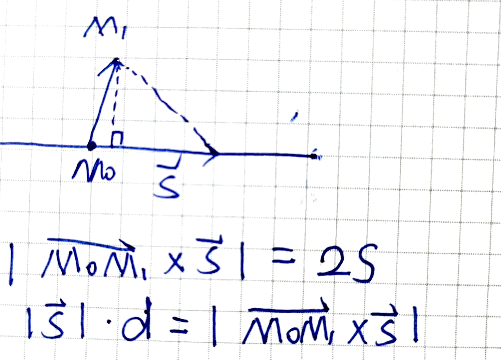

<head>
  
  
</head>

## 第十章：空间解析几何

#### 定义：
1. 方向角：向量与$x,y,z$轴的夹角记为方向角分别为$\alpha,\beta,\gamma$
2. 方向余弦：方向角的余弦

    $$\begin{cases}
        cos\alpha=\frac{a_1}{\sqrt{a_1^2+b_1^2+c_1^2}}\\
        cos\beta=\frac{b_1}{\sqrt{a_1^2+b_1^2+c_1^2}}\\
        cos\gamma=\frac{c_1}{\sqrt{a_1^2+b_1^2+c_1^2}}\\
        cos^2\alpha+cos^2\beta+cos^2\gamma=1\\
        \vec{a}^0=\{cos\alpha,cos\beta,cos\gamma\}
    \end{cases}$$

#### 向量运算
1. 数量积：$\vec{a}·\vec{b}=\|\vec{a}\|\|\vec{b}\|cos<\vec{a},\vec{b}>$

2. 向量积:（一）方向：右手定则；（二）大小：$\|\vec{a}\times \vec{b}\|=\|\vec{a}\|\|\vec{b}\|sin<\vec{a},\vec{b}>$

3. 代数运算：
   
   $$\begin{cases}
    \vec{a}·\vec{b}=a_1a_2+b_1b_2+c_1c_2\\
    \vec{a}\times \vec{b}=\{b_1c_2-b_2c_1,a_2c_1-a_1c_2,a_1b_2-a_2b_1\}
   \end{cases}$$

4. 性质说明：
   
   - $\vec{a}·\vec{a}=\|\vec{a}^2\|$
   
   - $\vec{a}·\vec{b}=0\rightarrow$两向量平行
   
   - $\vec{a}\times \vec{b}=-\vec{b}\times \vec{a}$
   
   - $\vec{a}\times \vec{b}=\vec{0}\rightarrow\vec{a}//\vec{b}$
   
   - $\|\vec{a}\times \vec{b}\|=2S_{\Delta}$

#### 应用

1. *旋转曲面*：绕哪个轴转哪个不变，$\sum_x:f(x,\pm \sqrt{y^2+z^2});\sum_y:f(\pm \sqrt{x^2+z^2},y^2)$
   
   例如：$\frac{x^2}{4}+y^2=1;z=0;$求$\sum_x\Rightarrow\frac{x^2}{4}+y^2+z^2=1$

2. *平面表达式*：
   
   （一）点法式：已知面上一点$M_0(x_0,y_0,z_0),\vec{n}=\{A,B,C\}$,则平面可表达为：

   $$A(x-x_0)+B(y-y_0)+C(z-z_0)=0$$

   注：法向量可由两向量叉乘得到哦(-v-)

   （二）一般式：一般表示为：

   $$Ax+By+Cz+D=0,\vec{n}=\{A,B,C\}$$

   （三）截距式：已知平面与三轴交于$(a,0,0)(0,b,0)(0,0,c)$,面可以表示为：
   
   $$\frac{x}{a}+\frac{y}{b}+\frac{z}{c}=1$$

   注：曲面上一点$M_0(x_0,y_0,z_0)$的法线可表示为：$\vec{n}=\{F_x,F_y,F_z\}_{M_0}$

3. *空间直线*
   
   （一）点向式：已知$l$上一点$M_0(x_0,y_0,z_0),\vec{s}=\{m,n,p\}//l$，则直线可表达为：

   $$\frac{x-x_0}{m}=\frac{y-y_0}{n}=\frac{z-z_0}{p}$$

   （二）一般式：直线可表达为：

   $$\begin{cases}
    A_1x+B_1y+C_1z+D_1=0\\
    A_2x+B_2y+C_2z+D_2=0
   \end{cases}$$

   （三）参数式，已知点向式，可推得：
   
   $$\begin{cases}
    x=mt+x_0\\
    y=nt+y_0\\
    z=pt+z_0
   \end{cases}$$

4. 距离
   
   （一）空间两点之距：已知$A(x_1,y_1,z_1),B(x_2,y_2,z_3)$则

   $$\|AB\|=\sqrt{(x_2-x_1)^2+(y_2-y_1)^2+(z_2-z_1)^2}$$

   （二）点到平面的距离：

   $$d=\frac{\|Ax_0+By_0+Cz_0+D\|}{\sqrt{A^2+B^2+C^2}}$$

   （三）平行平面的距离：

   $$d=\frac{\|D_1-D_2\|}{A^2+B^2+C^2}$$

   （四）点到直线的距离：

   

   （五）异面直线的距离：设$l_1,l_2$上的两点和方向向量为$m_1,m_2,\vec{s_1},\vec{s_2}$
   
   F1：判断是否异面：$(\vec{s_1}\times \vec{s_2})·\vec{m_1m_2}$是否等于$0$,若等于则异面

   F2:1.过$l_1$一点做平行于$l_2$的直线，构成一个平面，则$l_2$上一点到该面的距离为两线的距离
