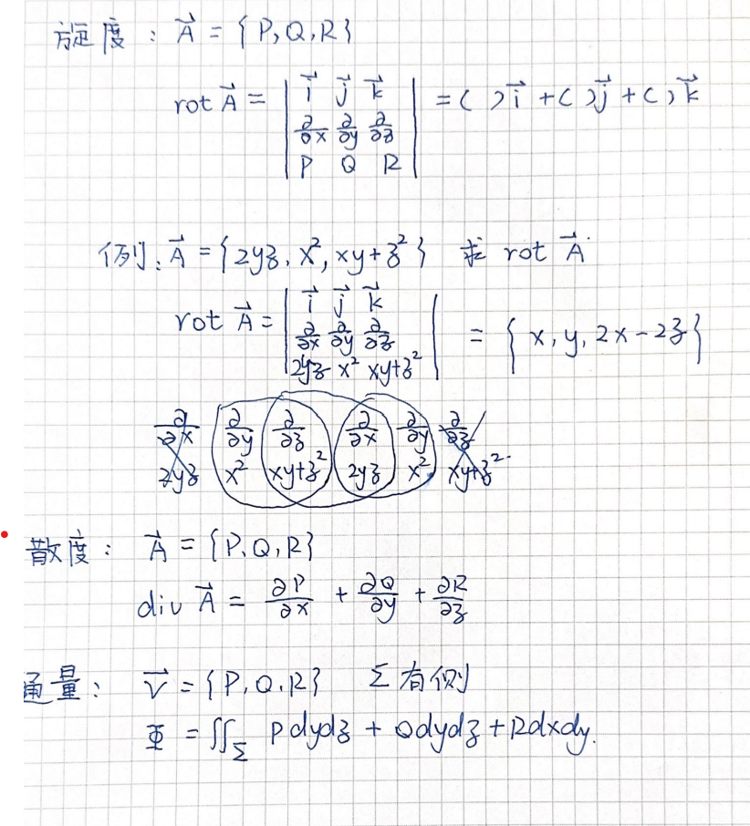

<head>
  
  
</head>

# 第十一章：曲线和曲面积分

## 第一类曲线积分（对弧长）
（一）$\int _lf(x,y)ds$称为$f(x,y)$在$l$上对弧长的曲线积分

（二）性质：$\int _l1ds=l$其他类似普通积分

（三）计算方法（直角坐标下）：$L=\phi(x)(a<x<b)$

$$\int _lf(x,y)ds=\int_a^bf(x,\phi(x))\sqrt{1+\phi'^2(x)}dx$$

（四）计算方法（极坐标下）：$x=\phi(t),y=\Phi(t)$

$$\int _lf(x,y)ds=\int_{\alpha}^{\beta}f[\phi(t),\Phi(t)]\sqrt{\phi'^2(t)+\Phi'^2(t)}dt$$

## 第二类曲线积分（对坐标）
（一）应用情形（做工）：$dw=\vec{F}·\vec{s},\vec{F}=\{P(x,y), Q(x,y)\},\vec{S}=\{dx,dy\}\Rightarrow w=\int _LP(x,y)dx+Q(x,y)dy$

（二）性质:$\int _{L^-}=-\int _L$

（三）解题方法（直角坐标）：$y=\phi(x)$

$$\int _LP(x,y)dx+Q(x,y)dy=\int_{a}^{b}\{P(x,\phi(x))+Q(x,\phi(x))\phi'(x)\}dx$$

（四）解题方法（极坐标）：$x=\phi(t),y=\Phi(t)$

$$\int _LP(x,y)dx+Q(x,y)dy=\int _{\alpha}^{\beta}\{P(\phi(t),\Phi(t))\phi'(t)+Q(\phi(t),\Phi(t))\Phi'(t)\}dt$$

（五）概念：一、单连通区域：逆时针为正；二、双连通区域：外逆内负为正

（六）格林公式：

  - 条件：1.$D$为$xoy$面内连通区域；2. $L$为$D$的正向边界
  - 结论：$\int _LPdx+Qdy=\int \int (\frac{\partial Q}{\partial x}-\frac{\partial P}{\partial y})ds$

（七）设$D$为单连通区域；$P(x,y),Q(x,y)$在区域内连续可偏导，则与以下四个等价：

$$\begin{cases}
    曲线积分与路径无关\\
    D内恒有\frac{\partial Q}{\partial x}=\frac{\partial P}{\partial y}\\
    D内存在函数u(x,y),使du(x,y)=Pdx+Qdy
\end{cases}$$

推论：
 1. 若$\frac{\partial Q}{\partial x}=\frac{\partial P}{\partial y},$则原式$=\int _{(x_0,y_0)}^{(x_1,y_1)}Pdx+Qdy=\int _{x_0}^{x_1}P(x,y_0)dx+\int _{y_0}^{y_1}Q(x_1,y)dy$ 
 2. 若$\frac{\partial Q}{\partial x}=\frac{\partial P}{\partial y},$则原式$=\int _{(x_0,y_0)}^{(x,y)}Pdx+Qdy=\int _{x_0}^{x}P(x,y_0)dx+\int _{y_0}^{y}Q(x,y)dy$ 

# 曲面积分
## 第一类曲面积分（对面积积分）

（一）性质：
 
  1. $\int \int _{\sum}1ds=A$
  2. $\sum$上下对称，上部面为$\sum _1$（其他情形类似）

   $$\begin{cases}
    f(x,y,-z)=f(x,y,z),\int \int _{\sum}=2\int \int _{\sum _1}\\
    f(x,y,-z)=-f(x,y,z),\int \int _{\sum}=0
   \end{cases}$$

（二）计算（设$z=\phi(x,y)$情形下）

$$I=\int \int _{\sum}f(x,y,z)ds=\int \int _{D_{xy}}f[x,y,\phi(x,y)]\sqrt{1+(\frac{\partial z}{\partial x})^2+(\frac{\partial z}{\partial y})^2}dxdy$$

## 第二类曲面积分（对坐标的曲面积分）

（一）定义：$\vec{ds}=(dydz,dxdz,dxdy),\vec{v}=(P,Q,R),\int \int _{\sum}Pdydz+Qdxdz+Rdxdy$

（二）性质：

  1. $\int \int _{\sum ^-}Pdydz+Qdxdz+Rdxdy=-\int \int _{\sum}Pdydz+Qdxdz+Rdxdy$
  2. $\int \int _{\sum}Pdydz+Qdxdz+Rdxdy=\int \int _{\sum}Pcos\alpha +Qcos\beta+Rcos\gamma ds$

（三）计算：

  1. $\int \int _{\sum}Pdydz$（其他方向类似，面朝自己的面为正）
   
   第一步：$x=\phi(y,z),yz\in D(y,z)$

   第二步：$\int \int _{\sum}Qdydz=\pm \int \int _{D_{yz}}P[\phi(y,z),y,z]dydz$

   Tips：关于轴对称的奇函数=2正的面

  2. 高斯公式，已知一个封闭几何体$\Omega,\sum$为其朝外表面
   
   $$\int \int _{\sum}Pdydz+Qdxdz+Rdxdy=\int \int \int _{\Omega}(\frac{\partial P}{\partial x}+\frac{\partial Q}{\partial y}+\frac{\partial R}{\partial z})dv$$
 
 
  