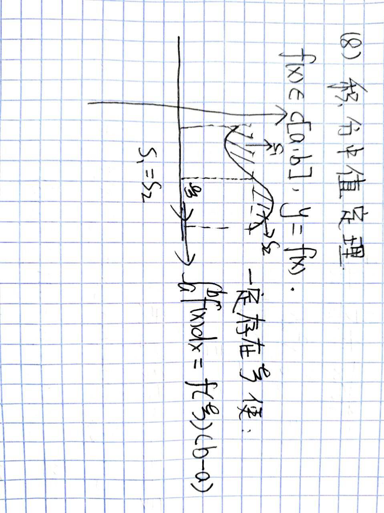
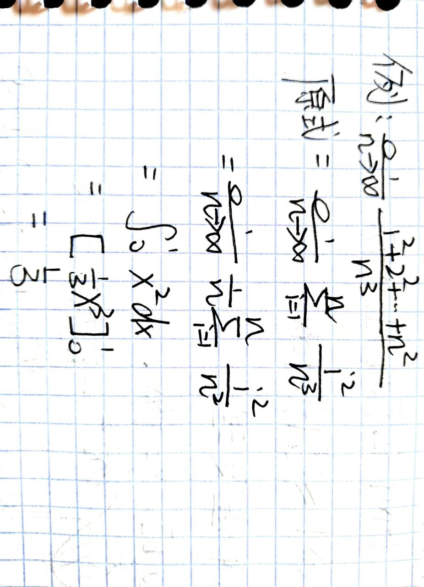

<head>
  
  
</head>

[定义](#1-定义)

[定积分一般性质](#2-定积分一般性质)

[基本定理](#3-定积分基本定理)

[定积分特殊性质](#4-定积分特殊性质)

# 第五章：定积分及其应用

## §1 定义
设 $f(x)$ 在 $[a,b]$ 上有界，$\lambda = max${$\xi_1,\xi_2,...,\xi_n$},则 $\lim_{\lambda \to 0}f(\xi _i)\Delta \xi_i$ 为 $f(x)$ 在 $[a,b]$ 上的积分。

## §2 定积分一般性质
- $\int^a_af(x)dx=0$

- $\int^b_af(x)dx=-\int^a_bf(x)dx$

- $\int^b_af(x)+g(x)dx=\int^b_af(x)dx+\int^b_ag(x)dx$

- $\int^b_amf(x)dx=m\int^b_af(x)dx$

- $\int^c_af(x)dx=\int^b_af(x)dx+\int^c_bf(x)dx$

- 几何性质

  $$\begin{cases}
      f(x)\geq 0,\int^b_af(x)dx=s\\
      f(x)\leq 0,\int^b_af(x)dx=-s
  \end{cases}$$

  $f(x)$ 有正有负的时候 $\int^b_af(x)dx=s_正-s_负$

- $f(x),g(x)$ 在 $[a,b]$ 可积，且 $f(x)>g(x)$ ，则 $\int^b_af(x)dx>\int^b_ag(x)dx$

- $f(x),\lvert f(x)\rvert$ 在 $[a,b]$ 可积$\rightarrow \lvert\int^b_af(x)dx\rvert\leq \int^b_a\lvert f(x)\rvert dx$

- 积分中值定理

  $f(x) \in [a,b],f(x) $ 在 $[a,b]$ 可积，一定存在$\xi \in [a,b] \rightarrow \int^b_af(x)dx=f(\xi)(b-a)$

## §3 定积分基本定理

- **积分中值定理推论**

## §4 定积分特殊性质
1.  $f(x)$ 在 $[0,1]$ 上可积

  $$\lim_{n \to \infty}\frac 1 n \displaystyle \sum^n_{i=1}f(\frac {i-1} n)=\lim_{n \to \infty}\frac 1 n \displaystyle \sum^n_{i=1}f(\frac i n)=\int^1_0f(x)dx$$

  注意$x=\frac i n$,这个只能在分子分母皆齐，分母比分子高一次的情况下使用

  **例题**

  $$\lim_{n \to \infty}\frac{1^2+2^2+...+n^2}{n^3}$$

  [答案](../pic/Chapter5.2.jpg)
  
  
  
  
