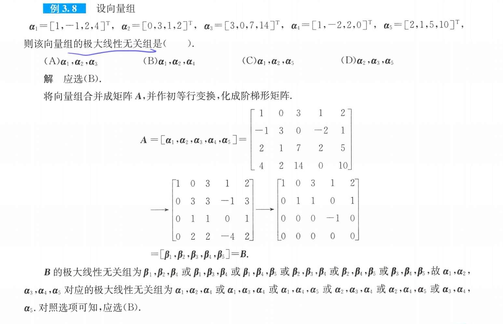
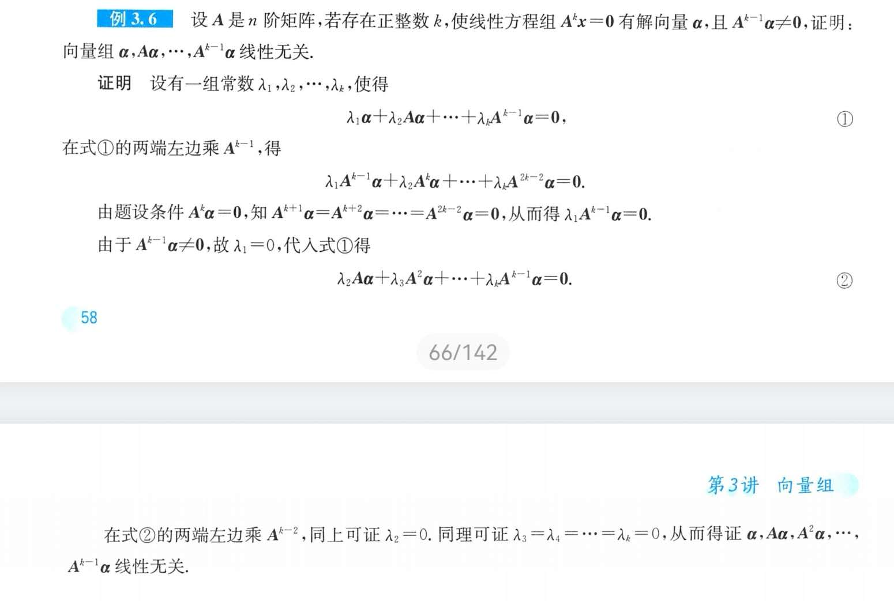
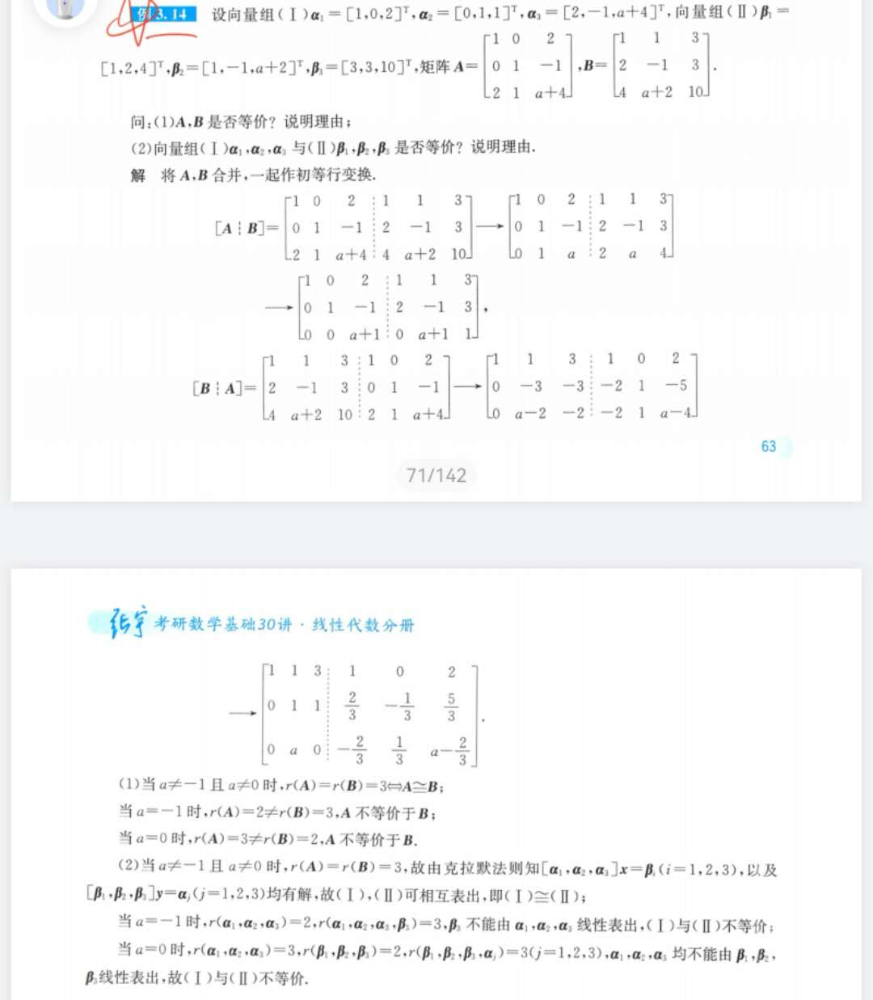
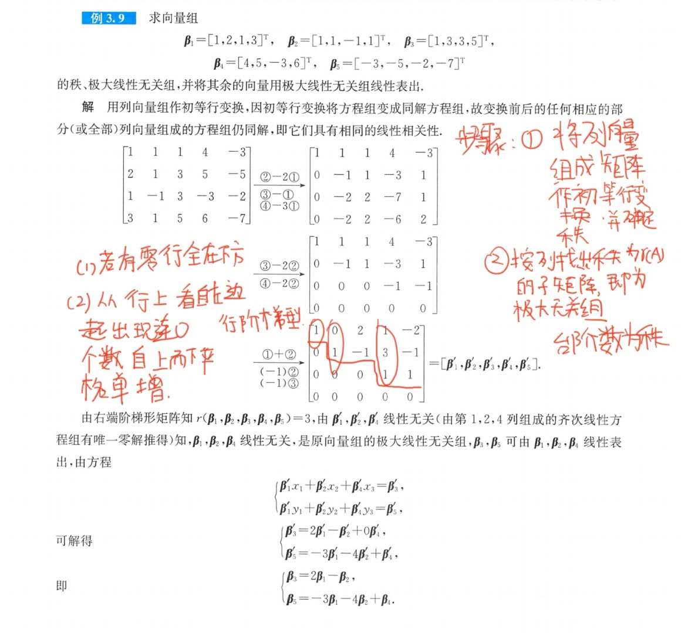
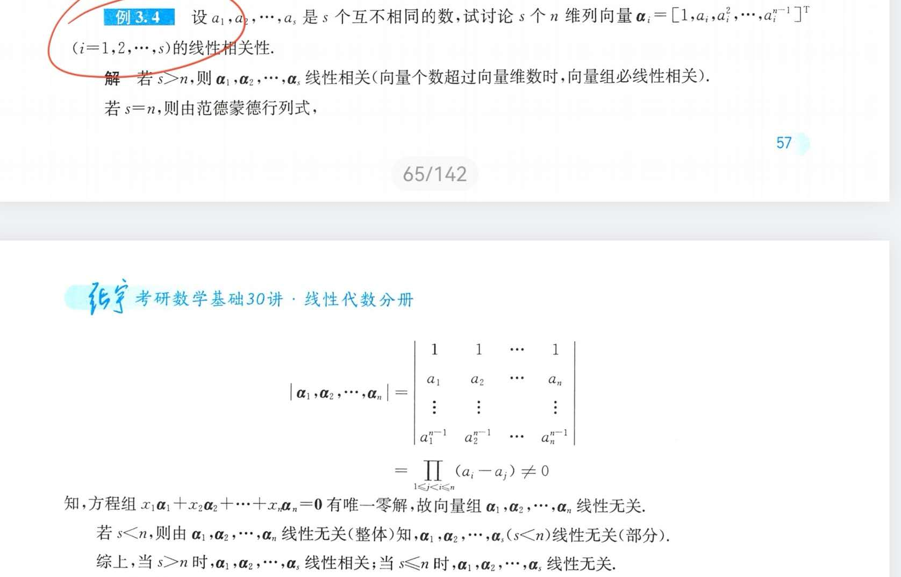
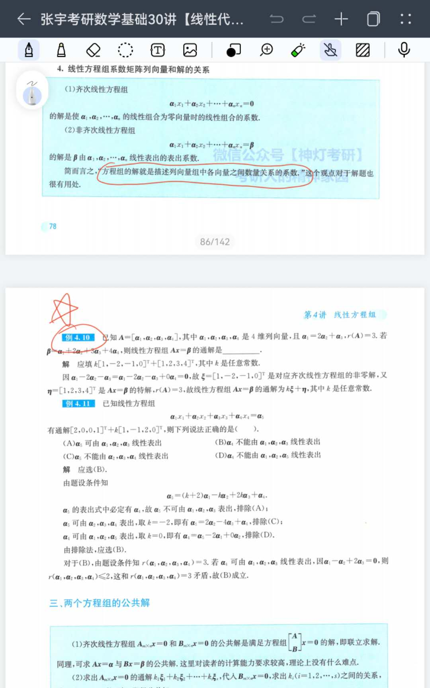
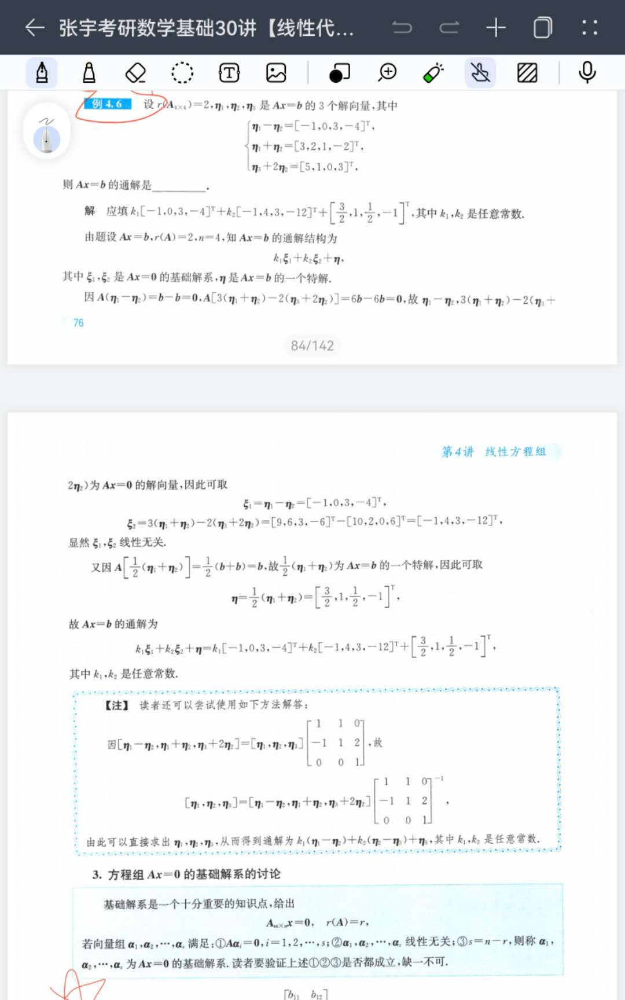

<head>
  
  
</head>

## 目录：

- [行列式](#行列式)
  - [第一种概念：几何意义](#第一种概念几何意义)
  - [第二种概念：逆序数法](#第二种概念逆序数法)
  - [第三种概念：行列式展开定理](#第三种概念行列式展开定理)
  - [行列式习题,仅技巧型](#行列式习题仅技巧型)
- [矩阵](#矩阵)
  - [矩阵的基本运算](#矩阵的基本运算)
  - [转置矩阵](#转置矩阵)
  - [矩阵的逆](#矩阵的逆)
  - [伴随矩阵](#伴随矩阵)
  - [转置，逆，伴随公式对比](#转置逆伴随公式对比)
  - [初等变换与初等矩阵](#初等变换与初等矩阵)
  - [等价矩阵和矩阵的等价标准型](#等价矩阵和矩阵的等价标准型)
  - [矩阵的秩](#矩阵的秩)
- [向量组](#向量组)
  - [相关概念](#相关概念)
  - [判断线性相关的七大定理](#判断线性相关的七大定理)
  - [极大线性无关组、等价向量组、向量组的秩](#极大线性无关组等价向量组向量组的秩)
  - [向量空间](#向量空间)
  - [题目练习](#题目练习)
- [线性方程组](#线性方程组)
  - [齐次线性方程组](#齐次线性方程组)
  - [非齐次线性方程组](#非齐次线性方程组)
    - [题型](#题型)
  - [两个方程组的公共解](#两个方程组的公共解)
  - [同解方程组](#同解方程组)
- [特征值与特征向量](#特征值与特征向量)
  - [求解特征方程](#求解特征方程)

# 行列式

## 第一种概念：几何意义

**概念**：二阶行列式可看成两个二维向量组成的，其值为以两向量为临边的平行四边形的面积；三阶行列式可看成由三个三维向量组成，其值为三个向量为边组成的面积

**性质**：

- $\lvert A\rvert$=$\lvert A^T\rvert$，及行列式中行列地位相同
- 若行列式中某行全为 0 则值为 0
- 若行列式中两行（列）成比例，则值为 0
- 若某行或某列有公因子则可提出
- 单行可加性
- 行列式中两行（列）互换，反号
- 行列中某行的某倍加到另一行上值不变

## 第二种概念：逆序数法

见老汤笔记

## 第三种概念：行列式展开定理

**余子式**：记作 $M_{ij}$；

**代数余子式**：记作$A_{ij}=(-1)^{i+j}M_{ij}$

$$\lvert A\rvert=\sum _{i=1}^{n}a_{ij}A_{ij}$$

**几个重要行列式**：

 （一）：主对角线行列式等于主对角线之积
 （二）：副对角线行列式=$(-1)^{\frac{n(n-1)}{2}}a_{1n}a_{2,n-1}····$
 （三）：拉普拉斯展开式：$A$为$m$阶矩阵，$B$为$n$阶矩阵

 $$\begin{vmatrix}
    A & 0\\
    0 & B
 \end{vmatrix}=
 \begin{vmatrix}
    A & 0\\
    C & B
 \end{vmatrix}=
 \begin{vmatrix}
    A & c\\
    0 & B
 \end{vmatrix}=\lvert A \rvert \lvert B \rvert$$

$$\begin{vmatrix}
    0 & A\\
    B & 0
 \end{vmatrix}=
 \begin{vmatrix}
    0 & A\\
    B & C
 \end{vmatrix}=
 \begin{vmatrix}
    C & A\\
    B & 0
 \end{vmatrix}=(-1) ^{mn} \lvert A \rvert \lvert B \rvert$$

 （四）范德蒙德行列式

 $$\begin{vmatrix}
  1 & 1 & \cdots & 1 \\
  x_1 & x_2 & \cdots & x_n\\
  x_1^2 & x_2^2 & \cdots & x_n^2\\
  \cdots & \cdots & \cdots & \cdots\\
  x_1^{n-1} & x_2^{n-1} & \cdots & x_n^{n-1}\\
 \end{vmatrix}=\prod _{1 \leq i<j \leq n}(x_j-x_i)$$

 
 
## 行列式习题,仅技巧型

 （一）**标准爪型**：
   
   解题方法：通过倍数加减变换消边上的爪子

   [例题](LApic/l1.1.jpg)

 （二）**行（列）和相等**

   解题方法：行和或列和相等则相加提公因式，再去化简

   [例题](LApic/l2.2.jpg)

 （三）**异爪型**

   解题方法：1.阶数不高的直接展开 2.用递推法

   [例题](LApic/l3.3.jpg)

 （四）**抽象型行列式的计算**
   解题方法：要熟练地把线性组合表示成矩阵乘积的形式

   [例题](LApic/l4.4.jpg)

[返回目录](#目录)

# 矩阵

## 矩阵的基本运算

 （一）加法：两个同型矩阵对应元素相加

 （二）数乘矩阵

   $$k\begin{pmatrix}
    a_{11} & a_{12}\\
    a_{21} & a_{22}
   \end{pmatrix}=
   \begin{pmatrix}
    ka_{11} & ka_{12}\\
    ka_{21} & ka_{22}
   \end{pmatrix}$$

  （三）运算律

   $$\begin{split}
      A+B&=B+A \\
      (A+B)+C&=A+(B+C)\\
      k(A+B)&=kA+kB
   \end{split}$$
    
   注：
   
   $$\lvert kA \rvert =k^n \lvert A \rvert$$

  （四）矩阵的乘法
  
   > 设 $A_{m \times s},B_{s \times n}$ ，即 $A$ 的列数必须等于 $B$ 的行数， $AB$ 为 $m\times n$ 阶矩阵

   $$\begin{split}
    (AB)C &=A(BC) \qquad(1)\\
    A(B+C)&=AB+BC \qquad(2)\\
    (kA)B& =A(kB) \qquad(3)
   \end{split}$$
   
   注：$AB \neq BA;AB=0$ 得不出 $A or B=0;AB=AC$ 不得$B=C$

  （五）转置矩阵

   > 转置矩阵为将矩阵的行列互换得到的矩阵

   $$\begin{split}
    &(A^T)^T=A \qquad(1)\\
    &(kA)^T=kA^T \qquad(2)\\
    &(A+B)^T=A^T+B^T \qquad(3)\\
    &(AB)^T=B^TA^T \qquad(4)\\
    &m=n \text{时} \lvert A^T \rvert =\lvert A \rvert \qquad(5)
   \end{split}$$

 （六）向量的内积与正交
  
  - 内积
   > 设 $\alpha=[a_1,a_2,\cdots,a_n]^T,\beta=[b_1,b_2,\cdots,b_n]^T$

   $$(\alpha,\beta)=\alpha^T \beta= \sum _{i=1}^n a_ib_i$$

  - 正交
   > 当$(\alpha,\beta)=\alpha^T \beta = 0$ 时称 $\alpha,\beta$ 两向量正交

  - 向量的模

   $$||\alpha||=\sqrt{\sum _{i=1}^na_i^2}$$

   > $\lvert \lvert \alpha\rvert \rvert=1$ 时称为单位向量

  - 标准正交向量组
   > 向量组满足以下，则称为标准正交向量组

   $$a_i^Ta_j=\begin{cases}
    0,i \neq j\\
    1, i=j
   \end{cases}$$

 （七）施密特正交化（正交规范化）过程
   > 线性无关向量组 $\alpha_1,\alpha_2$ 正交化公式为：

   $$\begin{split}
    &\beta _1= \alpha _1 \qquad (1)\\
    &\beta _2 = \alpha _2 - \frac{(\alpha_2,\beta_1)}{(\beta_1,\beta_1)}\beta 1 \qquad (2)\\
    &\gamma_1=\frac{\beta _1}{||\beta _1||},\gamma_2=\frac{\beta _2}{||\beta _2||} \qquad (3)
   \end{split}$$

   > $\gamma_1,\gamma_2$ 为标准正交向量组

 （八）矩阵的幂
   
   > 矩阵的方不能靠经验公式

   $$\begin{split}
    (A+B)^2&=(A+B)(A+B)\\
    (A+B)(A-B)&=A^2+BA-AB-B^2\\
    f(x)=a_0+a_1x+\cdots +a_mx^m,&f(A)=a_0E+a_1A+\cdots+a_mA^m
   \end{split}$$

 （九）方阵乘积的行列式

   $$\lvert AB \rvert=\lvert A \rvert \lvert B \rvert$$

   $$\begin{pmatrix}
    A & O\\
    0 & B
   \end{pmatrix}^n=
   \begin{pmatrix}
    A^n & O\\
    0 & B^n
   \end{pmatrix}
   $$

   **正交矩阵**：$AA^T=E,A$ 的行（列）向量组为标准正交向量组

## 转置矩阵

   > 转置矩阵为将矩阵的行列互换得到的矩阵

   $$\begin{split}
    &(A^T)^T=A \qquad(1)\\
    &(kA)^T=kA^T \qquad(2)\\
    &(A+B)^T=A^T+B^T \qquad(3)\\
    &(AB)^T=B^TA^T \qquad(4)\\
    &m=n \text{时} \lvert A^T \rvert =\lvert A \rvert \qquad(5)\\
    &A^TA=\lvert A \rvert ^2 
   \end{split}$$

## 矩阵的逆

（一）定义

 1. $A$ 和 $B$ 是 $n$ 阶方阵，若 $AB=BA=E$ 则称 $A$ 是可逆矩阵，且逆唯一为 $B$ 记作 $A^{-1}$

 2. $A$ 可逆的充要条件是 $\lvert A \rvert \neq 0$ ：

 $$A^{-1}=\frac{1}{\lvert A \rvert}A^*$$

（二）性质与重要公式

$$\begin{split}
  &(A^{-1})^{-1}=A \qquad (1)\\
  &(kA)^{-1}=\frac{1}{k}A^{-1} \qquad(2)\\
  &(AB)^{-1}=B^{-1}A^{-1} \qquad(3)\\
  &(A^T)^{-1}=(A^{-1})^T \qquad(4)\\
  &\lvert A^{-1} \rvert=\lvert A \rvert^{-1} \qquad(5)
\end{split}$$
   
（三）定义法求逆矩阵

 1. 直接求出逆矩阵
 

 3. 一些简单分块矩阵的逆，有（左乘同行，右乘同列，添负号）：

 $$\begin{pmatrix}
  A & O\\
  O & B
 \end{pmatrix}^{-1}=
 \begin{pmatrix}
  A^{-1} & O\\
  O & B^{-1}
 \end{pmatrix}$$

 $$\begin{pmatrix}
  O & A\\
  B & O
 \end{pmatrix}^{-1}=
 \begin{pmatrix}
  O & B^{-1}\\
  A^{-1} & O
 \end{pmatrix}
 $$

 $$\begin{pmatrix}
  A & O\\
  C & B
 \end{pmatrix}^{-1}=
 \begin{pmatrix}
  A^{-1} & O\\
  -B^{-1}CA^{-1} & B^{-1}
 \end{pmatrix}$$
   
 $$\begin{pmatrix}
  A & C\\
  O & B
 \end{pmatrix}^{-1}=
 \begin{pmatrix}
  A^{-1} & -A^{-1}CB^{-1}\\
  O & B^{-1}
 \end{pmatrix}$$
   
 $$\begin{pmatrix}
  O & A\\
  B & C
 \end{pmatrix}^{-1}=
 \begin{pmatrix}
  -B^{-1}CA^{-1} & B^{-1}\\
  A^{-1} & O
 \end{pmatrix}$$
   
   $$\begin{pmatrix}
  C & A\\
  B & O
 \end{pmatrix}^{-1}=
 \begin{pmatrix}
  O & B^{-1}\\
  A^{-1} & -A^{-1}CB^{-1}
 \end{pmatrix}$$

（四）求逆矩阵的方法

 1. 如果$\lvert A \rvert \neq 0,A^-=\frac{1}{\lvert A \rvert}A^*$

 2. 初等变换法：

 $$\begin{pmatrix}
  A & \lvert & E
 \end{pmatrix}\underrightarrow{\text{行变换}}
 \begin{pmatrix}
  E & \lvert & A^-
 \end{pmatrix}$$

 3. 对于抽象矩阵：
   a. 定义法求逆矩阵
   b. 将矩阵分为几个可逆矩阵的乘积，因为两个可逆矩阵的乘积仍是可逆矩阵，$A=BC$ 则

    $$A^{-1}=(BC)^{-1}=C^{-1}B^{-1}$$

## 伴随矩阵

（一）定义

 将 $\lvert A \rvert$ 的 $n^2$ 个元素的代数余子式按以下形式排列的矩阵称为 $A$ 的伴随矩阵

 $$A^*=\begin{pmatrix}
  A_{11} & A_{21} & \cdots & A_{n1}\\
  A_{12} & A_{22} & \cdots & A_{n2}\\
  \cdots & \cdots & \cdots & \cdots & \\
  A_{1n} & A_{2n} & \cdots & A_{nn}
 \end{pmatrix}$$
   
 $$AA^*=A^*A=\lvert A \rvert E$$

（二）性质与公式

$$\begin{split}
  \lvert A^* \rvert =\lvert A \rvert^{n-1}\\
  (A^T)^*=(A^*)^T\\
  (A^{-1})^*=(A^*)^{-1}\\
  (AB)^*=B^*A^*\\
  (A^*)^*=\lvert A \rvert^{n-2}A\\
  (kA)^*=k^{n-1}A^*
\end{split}$$

## 转置，逆，伴随公式对比

$$\begin{split}
  &\lvert kA \rvert=k^n\lvert A \rvert\\
  &(kA)^T=kA^T\\
  &(kA)^{-1}=\frac{1}{k}A^{-1}\\
  &(kA)^*=k^{n-1}A^*
\end{split}$$

$$\begin{split}
  &(AB)^T=B^TA^T\\
  &(AB)^{-1}=B^{-1}A^{-1}
\end{split}$$  

## 初等变换与初等矩阵

（一）初等矩阵：指单位阵经过一次初等变换得到的矩阵

（二）性质：

  性质一：

  $$\begin{split}
  &\lvert E_{i}(k) \rvert =k\\
  &\lvert E_{ij} \rvert=-1\\
  &\lvert E_{ij}(k) \rvert=1\\
  &[E_i(k)]^{-1}=E_i(\frac{1}{k})\\
  &[E_{ij}]^{-1}=E_{ij}\\
  &[E_{ij}(k)]^{-1}=E_{ij}(-k)
  \end{split}$$

  性质二：

 $$[A \lvert E]通过初等行变换\Rightarrow [E \lvert A]$$  
  
  
  性质三：左行右列定理（略）

## 等价矩阵和矩阵的等价标准型

（一）等价矩阵定义

若存在$PAQ=B$,则称$A,B$矩阵等价，充要条件：两矩阵同型且 $r(A)=r(B)$

（二）等价标准型

以下等式右边称为$A$的等价标准型

$$PAQ=\begin{pmatrix}
  E_r & o\\
  o & o
\end{pmatrix}$$

## 矩阵的秩

秩的性质

（一）初等变换不改变矩阵的秩

（二）

$$\begin{split}
  &0 \leq r(A) \leq min(m,n)\\
  &r(kA)=r(A)\\
  &r(AB) \leq min[r(A),(B)]\\
  &r(A+B) \leq r(A)+r(B)\\
  &r(A)=r(A^T)=r(AA^T)=r(A^TA)
\end{split}$$

$$r(A^*)=\begin{cases}
  n,r(A)=n\\
  1,r(A)=n-1\\
  0,r(A)<n-1
\end{cases},A为n阶方阵$$

   
[返回目录](#目录)

# 向量组

## 相关概念

（一）线性组合:形如

$$k_1\alpha_1+k_2\alpha_2+\cdots+k_n\alpha_n$$

（二）线性表出：若$\vec{\beta}$能表示成向量组$\alpha_1,\alpha_2,\cdots,\alpha_n$的线性组合，则称$\vec{\beta}$能被该向量组线性表出

$$\vec{\beta}=k_1\alpha_1+k_2\alpha_2+\cdots+k_n\alpha_n$$

（三）线性相关：对于向量组若存在一组不全为零的数使

$$k_1\alpha_1+k_2\alpha_2+\cdots+k_n\alpha_n=0$$

则称向量组线性相关

（四）线性无关：对于向量组若不存在一组不全为零的数使

$$k_1\alpha_1+k_2\alpha_2+\cdots+k_n\alpha_n=0$$

则称向量组线性无关

*注：一个向量作为向量组的时候，$\alpha=0$称作线性相关，反之，线性无关。

## 判断线性相关的七大定理

**定理一**： 线性相关的充要条件是向量组中至少有一个向量可由其余的向量线性表出，及至少有个向量多余

**定理二**：若向量组$\alpha_1,\alpha_2,\cdots,\alpha_n$线性无关，$\beta,\alpha_1,\alpha_2,\cdots,\alpha_n$线性相关，则$\beta$可由向量组$\alpha_1,\alpha_2,\cdots,\alpha_n$线性表出

**定理三**：如果向量组$\beta _1,\beta _2,\cdots,\beta _t$ 可由向量组 $\alpha_1,\alpha_2,\cdots,\alpha_s$ 线性表示，且 $t>s$ 则 $\beta _1,\beta _2,\cdots,\beta _t$ 线性相关。（少表示多，多的相关）

等价命题：如果向量组$\beta _1,\beta _2,\cdots,\beta _t$可由向量组 $\alpha_1,\alpha_2,\cdots,\alpha_s$ 线性表示，且$\beta _1,\beta _2,\cdots,\beta _t$线性无关，则$t \leq s$

**定理四**：向量组$\alpha_1,\alpha_2,\cdots,\alpha_n$线性相关的充要条件是齐次线性方程组 $Ax=0$ 有非零解

等价命题：向量组$\alpha_1,\alpha_2,\cdots,\alpha_n$线性无关的充要条件是齐次线性方程组 $Ax=0$ 只有零解

性质：

（一）$m(m>n)$个$n$维向量都是线性相关的（因为肯定有非零解）

（二）$n$个$n$维列向量$\alpha_1,\alpha_2,\cdots,\alpha_n$线性相关$\leftrightarrow \lvert A \rvert=0 \leftrightarrow Ax=0$有非零解

（三）$m<n$时用定理六，定理七

**定理五**：向量$\beta$可由向量组A:$\alpha_1,\alpha_2,\cdots,\alpha_n$线性表出$\leftrightarrow Ax=\beta $ 有解 $\leftrightarrow r(A)=r(A,\beta)$;反之若不能线性表出，$\leftrightarrow Ax=\beta $ 无解 $\leftrightarrow r(A)+1=r(A,\beta)$

**定理六**：若向量组中有一部分向量线性相关，则整个向量组线性相关；总之，部分向量相关，则整体也线性相关；整体线性无关，则任意部分都线性无关。

**定理七**:原来的向量组无关，则延长每个向量后依旧无关；原来的向量组相关，则缩短每个向量依旧相关。

## 极大线性无关组、等价向量组、向量组的秩
（一）极大线性无关组

在向量组$\alpha_1,\alpha_2,\cdots,\alpha_n$中，若存在部分$\alpha_{i_1},\alpha_{i_2},\cdots,\alpha_{i_n}$满足：

  1. $\alpha_{i_1},\alpha_{i_2},\cdots,\alpha_{i_n}$ 线性无关
  2. 向量组中任意向量可由$\alpha_{i_1},\alpha_{i_2},\cdots,\alpha_{i_n}$表出

则称$\alpha_{i_1},\alpha_{i_2},\cdots,\alpha_{i_n}$为向量组的极大线性无关组，一般极大线性无关组不唯一

**极大线性无关组求法**：将矩阵作初等行变换化为行阶梯形（零行放在最下面），梯数为矩阵的秩，再找秩个向量作为极大线性无关组

（二）等价向量组

设两个向量组：$(A)\alpha_1,\alpha_2,\cdots,\alpha_n,(B)\beta _1,\beta _2,\cdots,\beta _m$，若$(A)$中每个向量可由$(B)$线性表出，则称$(A)$可由向量组$(B)$线性表出；若俩向量组可互相线性表出，则称两向量组等价记作$A \simeq B$

**向量组和它的极大线性无关组是等价向量组**

向量组等价：$r(A)=r(B)=r(A \lvert B)$

（三）向量组的秩（向量所张成的空间维度）

向量组中的极大无关组中向量的个数称为向量组的秩

（四）有关秩的重要定理

1. 三秩相等

  矩阵的秩=矩阵行向量组的秩=矩阵列向量组的秩

2. 若$A \underrightarrow{\text{初等行变换}} B$，则
   1. $A$ 的行向量组和 $B$ 的行向量组等价
   2. $A,B$的任何相应的部分列向量组具有相同的线性相关性

3. 设向量组$A,B$其中$A$中任意向量可由$B$线性表出，则

$$r(A) \leq r(B)$$

4. $r(AB) \leq min[r(A),r(B)];r(A+B)\leq r([A,B]) \leq r(A)+r(B)$

## 向量空间

（一）概念

若$\xi _1,\xi _2,\cdots,\xi _n$是$n$维向量空间$R^n$中的线性无关的有序向量组，则$R^n$任意向量$\alpha$可由$\xi _1,\xi _2,\cdots,\xi _n$线性表出，记表出式为：

$$\alpha =\alpha _1 \xi _1+\alpha _2\xi _2+\cdots+\alpha _n\xi _n$$

则有序向量组$\xi _1,\xi _2,\cdots,\xi _n$是$R^n$的一个基，基向量的个数称为向量组的维数；$[\alpha _1,\alpha _2,\cdots,\alpha _n]$ 称为$\alpha$ 在基下的坐标，或称为坐标行向量

（二）基变换、坐标变换

1. 若 $\xi _1,\xi _2,\cdots,\xi _n$ 和$\eta _1,\eta _2,\cdots,\eta _n$ 是$R^n$的两个基，则：

  $$[\xi _1,\xi _2,\cdots,\xi _n]=[\eta _1,\eta _2,\cdots,\eta _n]C$$

  称为基变换，$C$称为$\eta _1,\eta _2,\cdots,\eta _n$到$\xi _1,\xi _2,\cdots,\xi _n$的过渡矩阵

2. 设$\alpha$在$\xi _1,\xi _2,\cdots,\xi _n$，$\eta _1,\eta _2,\cdots,\eta _n$两个基下的坐标为$x,y$，则有

 $$\alpha=[\xi _1,\xi _2,\cdots,\xi _n]x=[\eta _1,\eta _2,\cdots,\eta _n]y=[\xi _1,\xi _2,\cdots,\xi _n]Cy \rightarrow x=Cy$$

 称为坐标变换公式。
 
## 题目练习

   

 

# 线性方程组

## 齐次线性方程组

$$\begin{split}
  &x_1\alpha _1+x_2\alpha _2+\cdots +x_n \alpha _n=0\\
  &Ax=0
\end{split}$$

（一）有解的条件

当$r(A)=n,(\alpha _1,\alpha _2,\cdots,\alpha _n$线性无关$)$；方程组有唯一零解

当$r(A)=r<n$,方程组有无数个解，且有$n-r$个线性无关解

（二）解的性质

若$A\xi _1=0,A\xi _2=0$则$A(k_1\xi _1+k_2\xi _2)=0$

（三）基础解系和解的结构

1. 设$\xi _1,\xi _2,\cdots,\xi _{n-r}$满足：（1）是$Ax=0$的解；（2）线性无关；（3）方程组的任意一解可由$\xi _1,\xi _2,\cdots,\xi _{n-r}$线性表出，则称$\xi _1,\xi _2,\cdots,\xi _{n-r}$为方程组的基础解系
2. 通解：设 $\xi _1,\xi _2,\cdots,\xi _{n-r}$ 是方程组的基础解系，则 $ k_1\xi _1+\cdots +k_{n-r}\xi _{n-r} $ 是方程组的通解

（四）求解方法

初等行变换，化为行阶梯形矩阵$\rightarrow$选秩个线性无关列向量，并在空缺位置设线性无关向量，代入矩阵求解

## 非齐次线性方程组

（一）有解条件

1. $r(A)\neq r(A,B)\rightarrow r(A)+1=r(A,B)$ 则方程组无解
2. $r(A)= r(A,B)=n$ 有唯一解
3. $r(A)= r(A,B)=r<n$ 有无穷多解

（二）解的性质

设$\alpha _1,\alpha _2,\alpha$ 是非齐次线性方程组的解，$\xi$ 是齐次线性方程组的解，则

1. $\alpha _1-\alpha _2$ 是齐次线性方程组的解
2. 非齐次方程组的通解=齐次线性方程的通解+特解

### 题型
 

## 两个方程组的公共解

（一）$Ax=0$与$Bx=0$ 的公共解满足

$$\begin{pmatrix}
  A\\
  B
\end{pmatrix}x=0$$

  联立求解即可。

（二）求出$Ax=0$的通解，代入 $Bx=0$ 求出系数之间的关系，再代回 $Ax=0$ 的通解，即得公共解

（三）$Ax-0,Bx=0$ 得基础解系分别为 $\xi _1,\xi _2,\cdots,\xi _s;\alpha _1,\alpha _2,\cdots,\alpha _t$ ，则公共解 $\gamma = k_1 \xi _1+ k_2 \xi _2+\cdots +k_s \xi _s=l_1 \alpha _1+ l_2 \alpha _2+\cdots +l_t \alpha _t$ ，联立得：

$$ k_1 \xi _1+ k_2 \xi _2+\cdots +k_s \xi _s-(l_1 \alpha _1+ l_2 \alpha _2+\cdots +l_t \alpha _t)=0$$

解出$k,l$ 

## 同解方程组

概念：若两个方程组有完全相同的解，则称为同解方程组

$$\begin{split}
  &把两方程组的解互相代入求解即可\\
  &r(A)=r(B),且Ax=0的解满足Bx=0的解\\
  &r(A)=r(B)=r\begin{pmatrix}
    A\\
    B
  \end{pmatrix}
\end{split}$$

# 特征值与特征向量

（一）基本概念

$$A\xi=\lambda \xi$$

则称$\lambda$ 为$A$ 的特征值 $\xi$ 为$A$ 对应于$\lambda$ 的特征向量

$$\lvert \lambda E-A \rvert =0$$

称为$A$的特征方程

（二）基本性质

1. 
   
$$\begin{split}
  &\sum _{i=1}^n \lambda _i=\sum _{i=1}^n a_{ii}=tr(A)\\
  &\prod_{i=1}^n \lambda _i = \lvert A \rvert
\end{split}$$

2. 

$$\begin{split}
  &(1)k重特征值\lambda 最多有k个线性无关的特征向量\\
&(2)若\xi _1,\xi _2 是A 属于不同特征值 \lambda _1,\lambda _2的特征向量，则\xi _1,\xi _2线性无关\\
&(3)若\xi _1,\xi _2 是A 属于相同特征值 \lambda 的特征向量，则k_1 \xi_1 +k_2 \xi _2(k_1 k_2 \neq 0)仍是属于\lambda 的特征值
\end{split}$$

## 求解特征方程

方法：（一）根据特征方程求解$\lambda$ （二）代入求解特征向量

技巧：求$\lambda$ 时可以用猜值法做，并且当式子形如$x^k+a_{k-a}x^{k-1}+\cdots +a_0=0$时根是$a_0$的因子