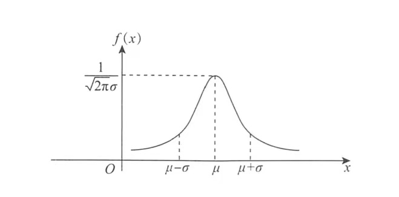
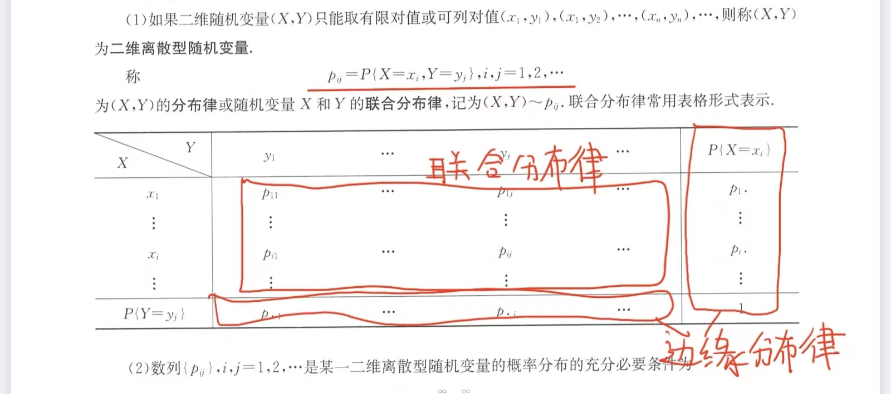

<head>
  
  
</head>

- [第一讲：随机事件与概率](#第一讲随机事件与概率)
  - [概念及基础公式](#概念及基础公式)
  - [古典概型](#古典概型)
  - [几何概型](#几何概型)
  - [概率的基本性质和公式](#概率的基本性质和公式)
  - [事件的独立性](#事件的独立性)
  - [伯努利试验](#伯努利试验)
- [第二讲：一维随机变量及其分布](#第二讲一维随机变量及其分布)
  - [随机变量及其分布函数的概念、性质及应用](#随机变量及其分布函数的概念性质及应用)
  - [常见的随机变量](#常见的随机变量)
  - [常见的随机变量分布类型](#常见的随机变量分布类型)
  - [一维随机变量函数的分布](#一维随机变量函数的分布)
- [第三讲：多维随机变量及其分布](#第三讲多维随机变量及其分布)
  - [二维随机变量及分布函数](#二维随机变量及分布函数)
  - [二维离散型随机变量的概率分布，边缘分布和条件分布](#二维离散型随机变量的概率分布边缘分布和条件分布)
  - [二维连续型随机变量的概率分布，边缘分布和条件分布](#二维连续型随机变量的概率分布边缘分布和条件分布)
  - [随机变量的相互独立性](#随机变量的相互独立性)
  - [多维随机变量函数的分布](#多维随机变量函数的分布)

# 第一讲：随机事件与概率

## 概念及基础公式

（一） $AB \neq \emptyset$ ，则称他们俩相容。 

（二）$AB = \emptyset$ ，则称他俩互斥；对立事件：两个事件必有一个发生。

（三）

$$\begin{split}
    &A-B=A\bar{B}=A-AB\\
    &A\cap(B\cup C)=(A\cap B) \cup (A\cap C)\\
    &A\cup (B\cap C)=(A\cup B) \cap (A\cup C)\\
    &A \cap (B-C)=A\cap B-A\cap C\\
    &\overline{A\cap B}=\bar{A}\cup \bar{B};\overline{A\cup B}=\bar{A}\cap \bar{B}
\end{split}$$

（四）频率： $\frac{k}{n}$ ；概率：随着试验基数越来越大，频率就越接近概率

## 古典概型

特点：（1）只有有限个样本点；（二）每个样本点发生的可能性都一样

排列：

$$A^m_n=\frac{n!}{(n-m)!}$$

组合：

$$C^m_n=\frac{n!}{(n-m)!m!}$$

## 几何概型

特点：（1）样本空间是个可度量的区域（2）每个样本点发生的可能性一样

## 概率的基本性质和公式

**（一）性质**

有界性： $P(A)=0 \neq A=\emptyset ;P(A)=1 \neq A=\Omega$

单调性：$A \subset B\rightarrow P(B-A)=P(B)-P(A)$

> $\sqrt{P(A)P(B)}\leq \frac{P(A)+P(B)}{2},P(A\lvert B)=\frac{P(AB)}{P(A)}   \geq P(AB)$

**（二）公式**

加法公式： 

$$P(A \cup B)=P(A)+P(B)-P(AB)$$

$$P(A \cup B \cup C)=P(A)+P(B)+P(C)-P(AB)-P(AC)-P(BC)+P(ABC)$$

>若 $A,B,C$ 为互不相容事件，则$P(A \cup B \cup C)=P(A)+P(B)+P(C)$

减法公式：

$$P(A-B)=P(A)-P(AB)=P(A\overline{B})$$

条件概率公式：

$$P(B\lvert A)=\frac{P(AB)}{P(A)}$$

> 所有公式都适用于条件概率公式如：$P(A-B\lvert C)=P(A\lvert C)-P(AB\lvert C)$

乘法公式：

$$P(AB)=P(A)P(B\lvert A)$$

>三项相乘：$P(ABC)=P(A)P(B\lvert A)P(C\lvert AB)$

条件概率公式（知因求果）：

$$\bigcup ^n_{i=1}A_i=\Omega,P(B)=\sum ^n_{i=1}P(A_i)P(B\lvert A_i)$$

贝叶斯公式（知果求因）:

$$\bigcup ^n_{i=1}A_i=\Omega,P(A_j\lvert B)=\frac{P(A_j)P(B\lvert A_j)}{\sum ^n_{i=1}P(A_i\lvert B)}$$

## 事件的独立性

**（一）定义**

设 $A,B$ 为两个事件，如果 $P(AB)=P(A)P(B)$ 则称事件$A,B$ 互相独立

> 如果$P(AB)=P(A)P(B),P(AC)=P(A)P(C),P(BC)=P(B)P(C),P(ABC)=P(A)P(B)P(C)$ 则称互相独立，若最后一个条件没有则称为两两独立

## 伯努利试验

特点：

（一）只有两种对立结果
（二）每次实验的概率不变
（三）实验独立重复进行 $n$ 次

# 第二讲：一维随机变量及其分布

## 随机变量及其分布函数的概念、性质及应用

（一）分布函数的概念

设 $X$ 是随机变量， $x$ 是任意实数，称函数 $F(x)=P\lbrace X\leq x\rbrace,x\in R$ 为随机变量的分布函数，或称 $X$ 服从 $F(x)$ 分布，记作 $X\sim F(x)$

（二）性质

1. $F(x)$ 是 $x$ 的单调不减函数，对任意 $x_1<x_2 \rightarrow F(x_1)<F(x_2)$

2. $F(x)$ 是右连续函数，即 $F(x+0)=F(x)$ 

3. $F(-\infty)=0,F(+\infty)=1$

（三）分布函数的应用

$$\begin{split}
  &P\lbrace X\leq a\rbrace=F(a)\\
  &P\lbrace X< a\rbrace=F(a-0)\\
  &P\lbrace X= a\rbrace=F(a)-F(a-0)
\end{split}$$

## 常见的随机变量

（一）离散型随机变量

如果随机变量 $x$ 只能取有限个 $x_1,x_2,\cdots$ 则称 $X$ 为离散型随机变量，称

$$P\lbrace X= x_i\rbrace=P_i,i=1,2,\cdots$$

为其分布列、分布率或概率分布，记为 $X\sim p_i$ 概率分布常常用表格形式或矩阵形式表示，即

$X$|$x_1\qquad x_2\qquad \cdots$
---|---
$P$|$p_1\qquad p_2\qquad \cdots$

数列 $p_i$ 是离散型概率分布的充要条件是: $p_i\geq 0,\sum P_i=1$

设离散型随机变量 $X$ 的概率分布为 $P\lbrace X= x_i\rbrace=P_i$ ，则其分布函数

$$\begin{split}
  &F(x)=P\lbrace X\leq x\rbrace=\sum P\lbrace X= x_i\rbrace\\
  &P\lbrace X= x_i\rbrace=P\lbrace X\leq x_i\rbrace-P\lbrace X< x_i\rbrace=F(x_i)-F(x_i-0)\\
  &P\lbrace a<X\leq b\rbrace=P\lbrace X\leq b\rbrace -P\lbrace X\leq a\rbrace=F(b)-F(a)
\end{split}$$

（二）连续型随机变量

如果随机变量的分布函数能表达为

$$F(x)=\int ^x_{-\infty}f(t)dt$$

其中 $f(x)$ 为非负可积函数，则称其为连续性随机变量，称 $f(x)$ 为概率密度，记为 $X\sim f(x)$ 

改变 $f(x)$ 有限个点 $f(x)$仍是概率密度

$$P\lbrace a<X< b\rbrace=P\lbrace a<X\leq b\rbrace=P\lbrace a\leq X< b\rbrace=P\lbrace a\leq X\leq b\rbrace=\int ^b_a f(t)dt=F(b)-F(a)$$

## 常见的随机变量分布类型

（一）离散型

（1）$0-1$ 分布 $B(1,p)$

 如果 $X$ 的概率分布为 

 $$X\sim \begin{pmatrix}
  0 & 1\\
  p & 1-p
 \end{pmatrix}$$

 则称 $X$ 服从参数为 $p$ 的 $0-1$ 分布

（2）二项分布 $B(n,p)$ ($0-1$ 分布进行 $n$ 次)

 $X$ 的概率分布为 
 
 $$P\lbrace X=k\rbrace =C_n^Kp^k(1-p)^{n-k}$$

（3）泊松分布 $P(\lambda)$

 $\lambda$ 为强度参数， $X$ 的概率分布为 
 
 $$P\lbrace X=k\rbrace =\frac{\lambda ^k}{k!}e^{-\lambda}$$

（4）几何分布 $G(p)$ （首中即停止）

 $X$ 的概率分布为 
 
 $$P\lbrace X=k\rbrace =(1-p)^{k-1}p$$

（二）连续型

（1）均匀分布 $U(a,b)$

 $X$ 的概率密度和分布函数分别为 

 $$f(x)=\begin{cases}
  \frac{1}{b-a},a<x<b\\
  0\quad ,others
 \end{cases}$$

 $$F(x)=\begin{cases}
  0\quad ,x<a\\
  \frac{x-a}{b-a},a\leq x<b\\
  1\quad ,x\geq b
 \end{cases}$$

（2）指数分布 $E(\lambda)$

 $\lambda$ 为失效率，$X$ 的概率密度和分布函数分别为 

 $$f(x)=\begin{cases}
  \lambda e^{-\lambda x},x>0\\
  0\quad ,others
 \end{cases}$$

 $$F(x)=\begin{cases}
  1-e^{-\lambda x},x>0\\
  0\qquad ,others
 \end{cases}$$
 
（3）正态分布 $N(\mu,\sigma ^2)$

 $X$ 的概率密度为

 $$f(x)=\frac{1}{\sqrt{2\pi}\sigma}e^{-\frac{1}{2}(\frac{x-\mu}{\sigma})^2},x\in (-\infty,+\infty),\mu\in (-\infty,+\infty),\sigma\in (0,+\infty)$$

 $f(x)$ 关于 $x=\mu$ 对称，并在此处有最大值,如图

 

 当 $\mu=0,\sigma=1$ 称为标准正态分布，概率密度和分布函数分别为

  $$\phi(x)=\frac{1}{\sqrt{2\pi}}e^{-\frac{1}{2}x^2},x\in (-\infty,+\infty)$$

  $$\Phi (x)=\frac{1}{\sqrt{2\pi}}\int_{-\infty}^xe^{=\frac{t^2}{2}}dt$$

 $$\Phi (0)=\frac{1}{2}, \Phi (-x)=1-\Phi (x)$$

 若 $X$ 满足标准正态分布， $P\lbrace X>\mu _0\rbrace =\alpha$ 则称 $\mu _0$ 为上 $\alpha$ 分位点 

 若 $X\sim N(\mu,\sigma ^2)$:

 $$\begin{split}
  &F(x)=P\lbrace X\leq k\rbrace =\Phi (\frac{x-\mu}{\sigma})\\
  &F(\mu -x)+F(\mu +x)=1\\
  &P\lbrace a<X<b\rbrace= \Phi (\frac{b-\mu}{\sigma})-\Phi (\frac{a-\mu}{\sigma})\\
  &aX+b\sim N(a\mu+b,a^2\mu ^2)
 \end{split}$$

## 一维随机变量函数的分布

（一）概念

 设 $X$ 为随机变量，函数 $y=g(x)$ 则以随机变量为自变量的函数也是随机变量，称为随机变量 $X$ 的函数

（二）随机变量函数的分布

（1）离散型 到 离散型

$X$ 的概率分布为 $P\lbrace X= x_i\rbrace =p_i$ ，则 $X$ 的函数 $Y=g(X)$ 也是离散型随机变量，其概率分布为 $P\lbrace Y=g(x_i)\rbrace =p_i$

$$Y\sim \begin{pmatrix}
  g(x_1) & g(x_2) & \cdots\\
  p_1 & p_2 & \cdots 
\end{pmatrix}$$

若有的值相同，则合并为一项

（2）连续型 到 连续型

$$F_Y(y)=P\lbrace Y\leq y\rbrace =P\lbrace g(X)\leq y\rbrace=\int _{g(x)\leq y}f_X(x)dx$$

概率密度等于分布函数求导。

# 第三讲：多维随机变量及其分布

## 二维随机变量及分布函数

（一）当满足

 $$F(x,y)=P\lbrace X\leq x,Y\leq y\rbrace$$

 则称其为二维随机变量的联合分布函数。

（二）性质

 1. 单调性
  
   - 单调不减性
   - 右连续性
   - 有界性
     
     $F(-\infty ,y)=F(x,-\infty)=F(-\infty ,-\infty)=0,F(+\infty,+\infty)=1$

   - 非负性
     
     $P\lbrace x_1<X\leq x_2,y_1<Y\leq y_2\rbrace=F(x_2,y_2)-F(x_2,y_1)-F(x_1,y_2)+F(x_1,y_1)$
  
 （三）边缘分布函数

 $$F_X(x)=P\lbrace X\leq x\rbrace=P\lbrace X\leq x, Y\leq+\infty\rbrace=F(x,+\infty)$$

 同理，$F_Y(y)=F(+\infty,y)$

## 二维离散型随机变量的概率分布，边缘分布和条件分布

（一）概率分布

 

（二）联合分布函数、边缘分布、条件分布

- 联合分布函数
   
   $$F(X,Y)=P\lbrace X\leq x,Y\leq y\rbrace$$

   > 它是以 $(x,y)$ 为顶点的左下角平面上取所有可能值的概率和；对于区域上，其联合分布函数是区域内所有可能值的和

- 边缘分布
  
  $$P\lbrace X\leq x_i\rbrace=\sum _j^{=\infty}P\lbrace X\leq x_i,Y\leq y_j\rbrace$$

- 条件分布

$$P\lbrace X= x_i\lvert Y= y_j\rbrace =\frac{P\lbrace X=x_i,Y=y_j\rbrace}{P\lbrace Y=y_j\rbrace}$$

## 二维连续型随机变量的概率分布，边缘分布和条件分布

（一）联合分布函数与概率密度、边缘概率密度，条件概率密度

$$F(X,Y)=\int ^y_{-\infty}\int^x_{-\infty}f(u,v)dudv$$

- 在某区域上的分布函数
 
  $$P\lbrace (X,Y)\in G\rbrace =\iint_Gf(u,v)dudv$$

- 若 $f(x,y)$ 在该点处连续，则

 $$\frac{\partial ^2 F(x,y)}{\partial x\partial y}=f(x,y)$$

（二）边缘概率密度

$$F_X(x)=F(x,+\infty)=\int ^x_{-\infty}\int^{+\infty}_{-\infty}f(u,v)dvdu $$

则关于 $X$ 的边缘概率密度为

$$f_X(x)=\int^{+\infty}_{-\infty}f(x,y)dy$$

条件概率密度：

$$f_{X\lvert Y}(X\lvert Y)=\frac{f(x,y)}{f_Y(y)}$$

> $F_{X\lvert Y}(X\lvert Y)=\int _{-\infty}^xf_{X\lvert Y}(X\lvert Y)dx$ 称为 $X$ 在 $Y=y$ 条件下的条件分布函数

（三）常见的分布

- 二维均匀分布

 称 $(X,Y)$ 在平面区域 $D$ 内服从均匀分布，如果其概率密度为

 $$f(x,y)=\begin{cases}
  \frac{1}{S_D},(x,y)\in D\\
  0,else
 \end{cases}$$

 $S_D$ 为区域的面积。

 口诀：求谁不积谁，不积先定限，限内画条线，先交写下限，后交写上限。

## 随机变量的相互独立性

- 若 $F(x,y)=F_X(x)F_Y(y)$ 则称 $X$ 和 $Y$ 互相独立，我们也可由这个式子得出联合分布函数。

- 互相独立的性质：

 1. 对于二维离散型随机变量：

$$P\lbrace X= x_i\lvert Y= y_j\rbrace =P\lbrace X= x_i\rbrace $$

 2. 对于二维连续型随机变量:

$$f_{X\lvert Y}(X\lvert Y)=f_X(x)$$

3. 若二维随机变量相互独立，则他们构成的函数也互相独立

## 多维随机变量函数的分布

（一） $(X,Y)$ 一个是离散型，一个是连续型，针对离散型进行全集分解，而后应用全概率公式求得 $Z$ 的分布。

例题

（二）$(X,Y)$ 两个都是连续型， $(X,Y)\sim f(x,y)$ ,则 $Z=g(X,Y)$ 的分布函数

$$F(z)=p\lbrace g(X,Y)<z \rbrace =\iint_{g(X,Y)\leq z}f(x,y)dxdy$$

（三）相互独立的随机变量函数的分布及卷积公式

**口诀：** 积谁不换谁，换完求偏导

- 和的分布

$$Z=X+Y\rightarrow f_Z(z)=\int ^{+\infty}_{-\infty}f(x,z-x)dx=\int ^{+\infty}_{-\infty}f(z-y,y)dy$$ 

> $X,Y$ 相互独立的话 $f(x,z-x)=f_X(x)f_Y(Z-X)$

- 差的分布

$$Z=X-Y\rightarrow f_Z(z)=\int ^{+\infty}_{-\infty}f(z+y,y)dy=\int ^{+\infty}_{-\infty}f(x,z+x)dx$$

- 积的分布

$$Z=XY\rightarrow f_Z(z)=\int ^{+\infty}_{-\infty}\frac{1}{\lvert x\rvert}f(x,\frac{z}{x})dx=\int ^{+\infty}_{-\infty}\frac{1}{\lvert y\rvert}f(\frac{z}{y},y)dy$$

- 商的分布
  
$$Z=\frac{X}{Y}\rightarrow f_Z(z)=\int ^{+\infty}_{-\infty}\lvert y\rvert f(zy,y)dy$$

- max分布

$$F(z)=P\lbrace max(X,Y)\leq Z \rbrace=P\lbrace X\leq Z,Y\leq Z\rbrace$$

- min分布

$$F(z)=P\lbrace min(X,Y)\leq Z \rbrace=P\lbrace X\leq Z \cup Y\leq Z\rbrace$$

- 分布函数的可加性

 $$\begin{split}
  &x\sim B(n,p),y\sim B(m,p),x+y\sim B(m+n,p)\\
  &x\sim P(\lambda _1),y\sim P(\lambda_2),x+y\sim P(\lambda _1+\lambda _2)\\
  &x\sim N(\mu_1,\sigma _1^2),y\sim N(\mu_2,\sigma _2^2),x+y\sim N(\mu_1+\mu_2,\sigma _1^2+\sigma _2^2)
 \end{split}$$

