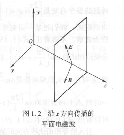

<head>
  
  
</head>

- [波动光学](#波动光学)
  - [§1. 第一节](#1-第一节)
    - [麦克斯韦方程组](#麦克斯韦方程组)
    - [物质方程](#物质方程)
    - [波动方程](#波动方程)
    - [电磁波](#电磁波)
    - [平面电磁波](#平面电磁波)

# 波动光学

## §1. 第一节

### 麦克斯韦方程组

基本物理量|物理意义
---|---
E|电场强度
D|电感强度
H|磁场强度
B|磁感强度
Q|闭合曲面内的电荷量
I|电流

静态电磁场规律(积分形式)：

$$\begin{split}
    &\oiint Dd\sigma=Q\\
    &\oint Edl=0\\
    &\oiint Bd\sigma=-\iint \frac{\partial B}{\partial t} d\sigma\\
    &\oint Hdl=I+\iint \frac{\partial D}{\partial t} d\sigma
\end{split}$$

交变场下(微分形式)：

$$\begin{split}
  &\nabla \cdot D=\rho\\
  &\nabla \cdot B=0\\
  &\nabla \times E=-\frac{\partial B}{\partial t}\\
  &\nabla \times H=j+\frac{\partial D}{\partial t}\\
\end{split}$$
 
$\rho$ 为电荷体密度， $j$ 为传导电流密度

### 物质方程

$$\begin{split}
  &D=\epsilon E\\
  &B=\mu H\\
  &j=\sigma E
\end{split}$$

$\epsilon$ 介电常数（电容率）， $\mu$ 磁导率 ，$\sigma$ 电导率 

### 波动方程

$$\begin{split}
  &\nabla ^2 E-\frac{1}{v^2}\frac{\partial ^2 E}{\partial t^2}=0\\
  &\nabla ^2 B-\frac{1}{v^2}\frac{\partial ^2 B}{\partial t^2}=0
\end{split}$$

### 电磁波

（一）电磁波在真空中传播的速度

$$c=\frac{1}{\sqrt{\epsilon _0 \mu _0}}$$

（二）人眼可见波段为 $390nm - 780nm$

（三）折射率

$$n=\frac{c}{v}=\sqrt{\frac{\epsilon \mu }{\epsilon _0 \mu _0}}$$

称为麦克斯韦关系式，$c,v$ 分别为光速和在介质中的速度

### 平面电磁波

（一）定义：平面电磁波指的是电场或磁场在与传播方向正交的平面上个点具有相同值的波

（二）波动方程的特解，也是平面简谐波的波函数

$$\begin{split}
  E=A\cos [\frac{2\pi}{\lambda}(z-vt)]\\
  B=A'\cos [\frac{2\pi}{\lambda}(z-vt)]
\end{split}$$

$A,A'$ 都是常矢量

（三）概念

- 平面简谐波：对于光波，就是平面单色光波的波函数
- 等相位面或波面：同一时刻相位相同的点的空间位置为波面，最前面的波面叫做波前

（四）量的公式

- 波矢量 $\vec{k}$ ：在各向同性介质中，其方向也是波能量的传播方向；其大小称为波数

$$k=\frac{2\pi}{\lambda}$$

- 频率

$$f=\frac{1}{T}=\frac{v}{\lambda}$$

- 波长

$$\lambda =\lambda _0/n$$

> $\lambda _0 为在真空中的波长$

- 平面简谐波电场的所有形式

$$\begin{split}
  &E=A\cos [\frac{2\pi}{\lambda}(z-vt)]\\
  &E=A\cos (kz-wt)\\
  &E=A\cos [2\pi (\frac{z}{\lambda}-\frac{t}{T})]
\end{split}$$

>由此可见，单色平面波函数最显著的特点就是它的时间周期性和空间周期性

（五）一般坐标系下的波函数

$$E=A\cos [k(x\cos \alpha +y\cos \beta +z\cos \gamma)-wt]$$

> 显然，在当沿着 $z$ 传播时， $\vec{k} \cdot \vec{r}=kz$

（六）复数形式的波函数

为了方便计算，将波函数写成如下形式：

$$E=Ae^{i(\vec{k}\cdot \vec{r}-wt)}$$

> 由这个式子可以看出光强 $I$正比于 振幅的平方 $A^2$

（七）平面简谐波的复振幅

$$\vec{E}=Ae^{i\vec{k}\cdot \vec{r}}$$